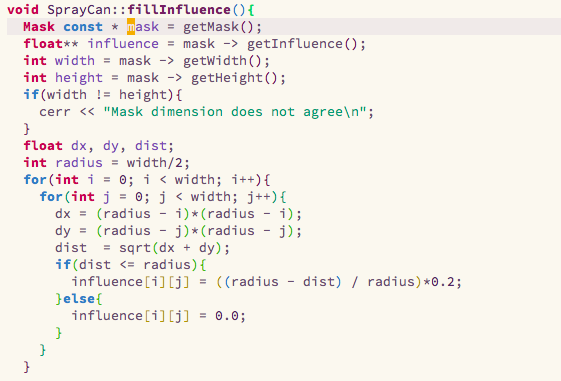

# Zhexuan Zachary Yang #

## Blog entry ##

#### My Contribution ####
My favorite tool that I implemented is `spray can`. As requirement, this tool is designed to simulate a real
spray can in real work.

At first place, I was unable to make it cycle and smooth. Back to then, the spray can tool was really ugly.
The code snippet I chose is my implementation for `fillInfluence` in `DrawTool` and was overriding in `SprayCan` class.

The reason that initial spray did not work very well is that I fill `influence` in a wrong way. As
stated in requirement file, the `influence` shall be filled as linearly in term of the distance. For the ugly
version, I used spiral matrix which was totally wrong. When program is executing, `influence` will be only
filled once. Hence, The cost of calculation of `sqrt`, `addition` and `subtraction` can be skipped if we use
`Mask` very often.

After I correct the way that `fillInfluence` being initializeed, spraycan tool works perfect.

copyright &copy; Zhexuan Yang
