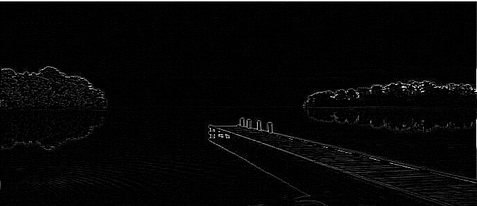
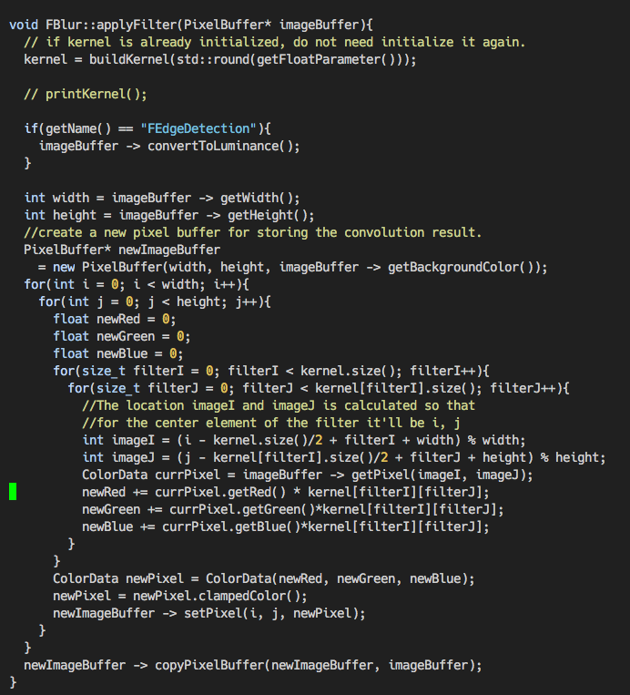

# Zhexuan Zachary Yang #

## Blog entry ##

#### My Contribution ####
In our second iteration, I am responsible for all filter tools in FlashPhoto. This is part is all about the choice of design parttrn we learnt in this class. 
For filer tools, inheritance is heavily used. After a few debate, multiple level inheritance was applied to avoid copying and pasting duplicated code. There are two different
type of filers. One is simple filter, another is convolution-based filter. Only convolution-based filter need interact with kernel matrix. However, all simple filters need 
override `applyFilter()` and give their own implementation. For convolution-based filter, it is not necessary to override `applyFilter()`. The only difference between different convolution-based filter is the choice of kernel matrix.  The different behavoir of two type filers become the reason we use multiple level inheritance in this project. We let
all simple filter including `FBlur` inherit from `Filter` class. Other convolution-based filters inherit from `FBlur` class.
In addition, Factory design pattern was used to create filter object at run time. By this way, the abstraction in `FlashPhoto` class is more accurate than what we did for iteration 1.

My faviorate filter is edge detection, The following is the deomo of the effect after appling edge dection. 

#### Implementation details ####

The key function for all convolution-based filter classes is `applyFilter()`. This function will effect in entire canvas buffer by a four nested for loop. 

copyright &copy; Zhexuan Yang
